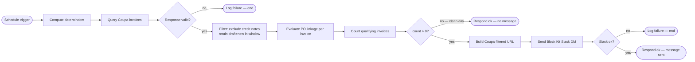

# Solution Design Document — No-PO Invoice Chaser

## Document History

| Date | Version | Author | Role | Comments |
|---|---|---|---|---|
| 2026-09-22 | 1.0 | uipath-architect | Architect | Initial SDD generated from PDD JACTIV-737 |

<!-- DO NOT RENAME: uipath-planner detects SDDs via this exact heading or the marker below. -->
<!-- planner-handoff:v1 -->
## Planner Handoff

| Field | Value |
|---|---|
| **Status** | ready |
| **Execution autonomy** | autonomous |
| **Delivery model** | cloud |
| **SDD scope** | single-product |
| **Project list section** | §7 Project Structure |
| **Tasks file** | `no-po-invoice-chaser-tasks.md` |
| **Generated by** | uipath-planner |
| **Generation date** | 2026-09-22 |
| **Template validation** | passed |

## 1. API Workflow Overview

| Field | Value |
|---|---|
| **API Workflow name** | no-po-invoice-chaser-api |
| **Objective** | Query Coupa for draft/new invoices from the past seven days, identify those with no properly linked PO, and deliver one Block Kit Slack DM to the AP SME; send nothing on a clean day |
| **Primary use case** | Integration — read Coupa, filter, notify Slack |
| **Invocation pattern** | Orchestrator weekday schedule trigger at 10:00 Romania time (Europe/Bucharest) |
| **Source PDD** | `docs/pdd-jactiv-737-no-po-invoice-chaser.md` |

### In Scope

- Weekday execution triggered at 10:00 Romania time (EET/EEST — Europe/Bucharest timezone, org architectural considerations §1)
- Coupa invoice query filtered by date window (past seven calendar days) and status (draft or new)
- Credit-note exclusion (BR-03)
- PO-linkage validation — description-only PO text treated as missing (BR-01, BR-02)
- Count of qualifying invoices; no per-invoice listing (BR-05)
- One Block Kit Slack DM to member ID `WLX9BD8FN` when qualifying count > 0 (BR-06)
- No-message behaviour on a clean day — zero qualifying invoices → no Slack message (BR-07) [ARCHITECT REVIEW: OQ-02 — section 7 of the PDD describes a congratulatory clean-day message that conflicts with BR-07; confirm the authoritative rule before production sign-off]
- No Coupa record is created, modified or deleted at any point in the process (BR-10)

### Assumptions

- Coupa connection `coupa-uipath-test` (id `5fadfc73-a372-46ae-a27c-2481741eed07`) is operational; a failed ping does not indicate a runtime failure (org architectural considerations §4, verified 2026-09-21)
- Slack connection `slack-product-test-app` (id `43d506f7-7de2-4798-aac1-9522e2e45dbb`) has `chat:write` scope and DM permission for member `WLX9BD8FN` [ARCHITECT REVIEW: OQ-07 — confirm before deploy]
- Coupa base URL for test tenant is `https://uipath-test.coupahost.com/api/`; production hostname must be confirmed before go-live [ARCHITECT REVIEW: OQ-04]
- Date display format in the Slack message defaults to `YYYY-MM-DD` [ARCHITECT REVIEW: OQ-06 — confirm preferred format with SME]
- No retry is applied to any call (BR-08); OQ-01 conflict between prose scope and future-state diagram is resolved in favour of the prose rule unless an architect review determines otherwise [ARCHITECT REVIEW: OQ-01]

---

## 2. Input Schema

This workflow is schedule-triggered with no external caller input. All values are computed at runtime.

| Field | Type | Required | Description | Example |
|---|---|---|---|---|
| _(none)_ | — | — | Schedule-triggered; no caller input | — |

### Sample Input

```json
{}
```

---

## 3. Output Schema

| Field | Type | Always Present | Description | Example |
|---|---|---|---|---|
| `status` | string | Yes | `"ok"` on success, `"failed"` on any terminal error | `"ok"` |
| `invoice_count` | integer | Yes on success | Count of qualifying no-PO invoices evaluated; 0 on a clean day | `12` |
| `slack_sent` | boolean | Yes on success | `true` if a Slack message was dispatched, `false` on a clean day | `true` |
| `error_message` | string | No — present only on failure | Human-readable failure description logged to Orchestrator | `"Coupa query returned HTTP 500"` |

### Sample Output — notify path

```json
{
  "status": "ok",
  "invoice_count": 12,
  "slack_sent": true
}
```

### Sample Output — clean day

```json
{
  "status": "ok",
  "invoice_count": 0,
  "slack_sent": false
}
```

---

## 4. Execution Flow



### Step Details

| # | Step | Activity Type | Input | Output | Notes |
|---|---|---|---|---|---|
| 1 | Compute date window | Script (`Assign` / JS) | System clock (`now`) | `windowStart` (now − 7 days, `YYYY-MM-DD`), `windowEnd` (now, `YYYY-MM-DD`), `runDate` (now, `YYYY-MM-DD`) | BR-04; all three values reused in query and Slack message |
| 2 | Query Coupa invoices | HTTP Request (connector) | `windowStart`, `windowEnd`; query params `status[in]=draft,new`, `invoice-date[gt_or_eq]`, `invoice-date[lt_or_eq]` | `$context.outputs.HTTP_Request_Coupa.content` — array of invoice objects | Connector `uipath-coupa-coupa`, connection `coupa-uipath-test`; relative path `invoices`; read-only; BR-04 |
| 3 | Validate Coupa response | If / Script | `HTTP_Request_Coupa.statusCode` | Boolean — valid or invalid | Non-200 or unparseable → log + end; BR-08, BR-09; S1, S2, S4 system errors |
| 4 | Filter invoices | Script | Invoice array from step 2 | `filteredInvoices` array (credit notes removed; `is-credit-note` field; only draft/new within window) | BR-03, BR-04; all predicates in one JS filter expression |
| 5 | Evaluate PO linkage | Script | `filteredInvoices` | `qualifyingInvoices` array (records where `po-number` / `order-header-num` on lines is absent or description-only) | BR-01, BR-02; field names confirmed from live tenant: `invoice-lines[].po-number` and `invoice-lines[].order-header-num`; OQ-05 resolved by live verification |
| 6 | Count qualifying invoices | Assign | `qualifyingInvoices` | `qualifyingCount` integer | BR-05 |
| 7 | Branch on count | If | `qualifyingCount` | Two paths: clean day (→ step 11) or notify (→ step 8) | BR-07; OQ-02 clean-day conflict — this SDD implements BR-07 (send nothing) pending architect review |
| 8 | Build Coupa filtered URL | Assign / Script | `windowStart`, `windowEnd` | `coupaUrl` string | Pattern: `https://uipath-test.coupahost.com/invoices?q%5Binvoice_date_gteq%5D={windowStart}&q%5Binvoice_date_lteq%5D={windowEnd}&q%5Bstatus_eq%5D=draft`; production base host confirmed before go-live [ARCHITECT REVIEW: OQ-04] |
| 9 | Send Block Kit Slack DM | HTTP Request (connector) | `qualifyingCount`, `coupaUrl`, `windowStart`, `windowEnd`, `runDate` | `HTTP_Request_Slack.statusCode`, `.content.ok` | Connector `uipath-salesforce-slack`, connection `slack-product-test-app`; relative path `chat.postMessage`; Block Kit payload inline in `body`; channel `WLX9BD8FN`; BR-06 |
| 10 | Validate Slack response | If / Script | `HTTP_Request_Slack.statusCode`, `.content.ok` | Boolean — delivered or failed | Non-200 or `ok:false` → log + end; BR-08, BR-09; S3 system error |
| 11 | Respond success | Response | `qualifyingCount`, `slack_sent` flag | Workflow output | `slack_sent: true` on notify path, `false` on clean day |

---

## 5. Connectors & External Calls

### Integration Service Connectors

| Connector key | Connection name | Connection id | Operation | Called in step | Relative path | Method | Key inputs | Key outputs |
|---|---|---|---|---|---|---|---|---|
| `uipath-coupa-coupa` | `coupa-uipath-test` | `5fadfc73-a372-46ae-a27c-2481741eed07` | List invoices | 2 | `invoices` | GET | `status[in]`, `invoice-date[gt_or_eq]`, `invoice-date[lt_or_eq]` | Invoice array in `.content` |
| `uipath-salesforce-slack` | `slack-product-test-app` | `43d506f7-7de2-4798-aac1-9522e2e45dbb` | Post DM | 9 | `chat.postMessage` | POST | Block Kit `body` with `channel`, `text`, `blocks` | `.content.ok`, `.statusCode` |

Activity shape, `bindings_v2.json` entry and connection-resource file: `docs/architectural-considerations.md` §4, verbatim.

### Integration Service Connections

| Connection name | System | Connector key | Connection id | Folder | Prerequisite action |
|---|---|---|---|---|---|
| `coupa-uipath-test` | Coupa | `uipath-coupa-coupa` | `5fadfc73-a372-46ae-a27c-2481741eed07` | `Fusion2026` | Existing — authorise before deploy; ping state does not reflect runtime state (org architectural considerations §4) |
| `slack-product-test-app` | Slack | `uipath-salesforce-slack` | `43d506f7-7de2-4798-aac1-9522e2e45dbb` | `Fusion2026` | Existing — confirm `chat:write` DM scope for `WLX9BD8FN` [ARCHITECT REVIEW: OQ-07] |

---

## 6. Error Handling

Per BR-08 and BR-09: no retry, no fallback, no error notification via Slack. A failed run produces a logged failure and a failed Orchestrator job only. One failure boundary at the workflow edge.

| Failure | Detection | Action | Who is told |
|---|---|---|---|
| Coupa query non-200 or unparseable body (S1, S2, S4) | `HTTP_Request_Coupa.statusCode` ≠ 200 or `.content` not an array | Log failure message to Orchestrator job log; return `status: "failed"`; end workflow | Orchestrator job marked failed — ops team via standard Orchestrator alerting |
| Slack `chat.postMessage` non-200 or `ok: false` (S3) | `HTTP_Request_Slack.statusCode` ≠ 200 or `.content.ok` ≠ `true` | Log failure message to Orchestrator job log; return `status: "failed"`; end workflow | Orchestrator job marked failed |
| Credential rejected at authentication (S5) | HTTP 401/403 from Coupa or Slack | Same as above; log which system rejected the credential | Orchestrator alert; credential owner (AP team / platform team) |
| Unhandled runtime exception (S6) | Uncaught exception reaches workflow boundary | Log exception with message; return `status: "failed"` | Orchestrator job marked failed |

No `Try/Catch` per individual activity — all failure modes share the single edge catch, because no call has a documented business fallback that differs from failing the run (org architectural considerations §8). Business exception B4 (Coupa response invalid) is covered by the S1/S2/S4 system error rows above — same detection and same response.

OQ-01 diagram vs. prose conflict: this SDD implements the prose rule (no retry). If OQ-01 resolution confirms that `httpRetryConfig` should be applied, the build adds it at the workflow level — one config block, not a do-while loop [ARCHITECT REVIEW: OQ-01].

---

## 7. Project Structure

```text
no-po-invoice-chaser-737/                 (solution root — sdd_scope: single-product)
└── no-po-invoice-chaser-api/             (API Workflow project)
    ├── project.uiproj                    (Name: "no-po-invoice-chaser-api")
    ├── Workflow.json                     (document.dsl — all activities)
    ├── entry-points.json                 (generated; one entry point)
    └── bindings_v2.json                  (one entry per HTTP Request activity)
Solution/
└── resources/
    └── solution_folder/
        ├── process/
        │   └── api/
        │       └── no-po-invoice-chaser-api.json
        └── connection/
            ├── uipath-coupa-coupa/
            │   └── coupa-uipath-test.json
            └── uipath-salesforce-slack/
                └── slack-product-test-app.json
```

### Solution / Project Breakdown

| Project | Product | Orchestrator folder | Attended / Unattended |
|---|---|---|---|
| `no-po-invoice-chaser-api` | API Workflow | `no-po-invoice-chaser-737` | N/A — serverless runtime |

### Reusable Components

| Type | Name | Details |
|---|---|---|
| reused | `coupa-uipath-test` connection | Shared program connection in `Fusion2026`; reference by id — do not recreate |
| reused | `slack-product-test-app` connection | Shared program connection in `Fusion2026`; reference by id — do not recreate |

### Environments (DEV / UAT / PROD)

| Item | DEV | UAT | PROD |
|---|---|---|---|
| Orchestrator + Tenant | Automation Cloud EU tenant (org architectural considerations §1) | Same tenant | Same tenant |
| Orchestrator folder | `no-po-invoice-chaser-737` | `no-po-invoice-chaser-737` | `no-po-invoice-chaser-737` |
| Coupa connection | `coupa-uipath-test` — test tenant (`uipath-test.coupahost.com`) | `coupa-uipath-test` | Production connection [ARCHITECT REVIEW: OQ-03, OQ-04 — production hostname and credentials required] |
| Slack connection | `slack-product-test-app` | `slack-product-test-app` | `slack-product-test-app` [ARCHITECT REVIEW: OQ-07 — confirm DM scope] |
| Schedule trigger timezone | `Europe/Bucharest` (OQ-08 — [DEFAULT]) | `Europe/Bucharest` | `Europe/Bucharest` |

---

## 8. Testing Strategy

### Happy Path

| Test ID | Scenario | Input / Setup | Expected result |
|---|---|---|---|
| T-01 | Qualifying invoices exist | Coupa returns ≥ 1 draft/new invoice with no PO link in the 7-day window | `status: ok`, `invoice_count` ≥ 1, `slack_sent: true`; Slack DM received by `WLX9BD8FN` with correct count and working Coupa URL |
| T-02 | Clean day — zero qualifying | All invoices in window have valid PO links or are credit notes | `status: ok`, `invoice_count: 0`, `slack_sent: false`; no Slack message dispatched |
| T-03 | Date window correctness | Run on a known date; verify Coupa query params `invoice-date[gt_or_eq]` and `invoice-date[lt_or_eq]` | Query spans exactly 7 calendar days; `windowStart` = today − 7, `windowEnd` = today |

### Business Exceptions

| Test ID | Exception | Setup | Expected result |
|---|---|---|---|
| T-B1 | Credit note excluded (B1) | Coupa returns invoice with `is-credit-note: true` | Record excluded from qualifying set; not counted; no contribution to `invoice_count` |
| T-B2 | Description-only PO treated as missing (B2) | Invoice with free text in description field, no value in `po-number` / `order-header-num` on lines | Invoice counted as qualifying (no-PO); included in `invoice_count` |
| T-B3 | Clean day — no Slack message (B3) | All invoices have valid PO links | `slack_sent: false`; Slack API not called |

### System Errors

| Test ID | Error | Simulation | Expected result |
|---|---|---|---|
| T-S1 | Coupa unresponsive (S1) | Mock HTTP 504 or connection refused from Coupa | `status: "failed"`; Orchestrator job failed; no Slack message |
| T-S2 | Coupa unexpected response structure (S2) | Mock Coupa returning non-array `.content` | `status: "failed"`; Orchestrator job failed; no Slack message |
| T-S3 | Slack API failure (S3) | Mock `chat.postMessage` returning `ok: false` | `status: "failed"`; Orchestrator job failed; no second Slack attempt |
| T-S4 | Credential rejected (S5) | Mock HTTP 401 from Coupa | `status: "failed"`; Orchestrator job failed; logged with credential system identified |
| T-S5 | Coupa response invalid — B4 | Mock Coupa returning HTTP error or malformed body | `status: "failed"`; Orchestrator job failed; no Slack notification sent; BR-08, BR-09 |

---

## 9. Next Steps

Build is performed by the `uipath-api-workflow` skill. Solution packaging and deployment are performed by the `uipath-solution` skill (`uip solution init` → `project add` → `resources refresh` → `pack`). Connection prerequisite verification (confirm `coupa-uipath-test` is authorised; confirm Slack DM scope for `WLX9BD8FN`) is performed by the `uipath-platform` skill.

The planner derives the task list from this document's `## Planner Handoff` header and §7 Project Structure.
